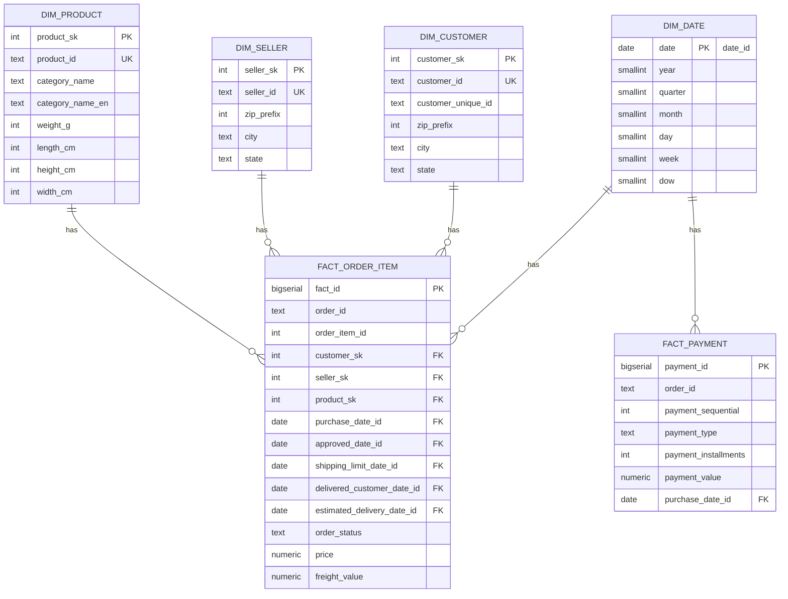

# Aula 02 - Exercício 01 - Ciclo de Vida de Dados
Este documento descreve a solução construída para o **Exercício 1** do ciclo de vida de dados, utilizando o dataset **Olist (e-commerce BR)** como fonte. O pipeline implementa **coleta, armazenamento, processamento, uso e retenção/descartes** e carrega um **Data Warehouse (DW) em esquema estrela** no PostgreSQL.

---

## 1) Visão Geral
- **Fonte**: CSVs públicos do _Olist_ (orders, customers, order_items, payments, reviews, products, sellers, category translation).
- **Tecnologia**: PostgreSQL 14+, Python 3.10+, **SQLAlchemy 2.0** com driver `psycopg2`.
- **Carga**: **`COPY FROM STDIN`** via `engine.raw_connection()` → alta performance para CSV.
- **Arquitetura**: _Staging_ (espelha os CSVs) → DW (dimensões e fatos).
- **Idempotência**: `TRUNCATE` nas tabelas de _staging_ + `ON CONFLICT` nas dimensões/fatos permite reprocessar sem duplicar.

### Ciclo de Vida aplicado
- **Coleta**: leitura direta dos CSVs locais e carga por `COPY` (sem parsers em Python).
- **Armazenamento**: _landing_ em `olist_stage.*` (tabelas raw, 1-para-1 com CSVs).
- **Processamento**: SQL para _upsert_ das dimensões e _insert/upsert_ das tabelas fato em `olist_dw.*`.
- **Uso**: consultas analíticas (ticket médio, top categorias, SLA etc.).
- **Retenção/Descartes**: manter _staging_ para auditoria/reprocesso; `TRUNCATE` antes de novas cargas.

---

## 2) Modelo de Dados (estrela simplificada)

**Dimensões**
- `dim_date (date_id PK)` – calendário (year, quarter, month, day, week, dow).
- `dim_customer (customer_sk PK, customer_id UK)` – cliente.
- `dim_seller (seller_sk PK, seller_id UK)` – vendedor.
- `dim_product (product_sk PK, product_id UK)` – produto + categoria (PT/EN) + atributos físicos.

**Fatos**
- `fact_order_item` (grão: **item do pedido**). Métricas: `price`, `freight_value`. Várias FKs de datas (compra, aprovação, limite envio, entrega, estimada).
- `fact_payment` (grão: **ordem × parcela**). Métrica: `payment_value`.


> Observação: a notação acima é ilustrativa; as constraints reais estão no DDL.

---

## 3) DDL (resumo)
Dois schemas:
- `olist_stage.*` – tabelas **raw**: `raw_customers`, `raw_orders`, `raw_order_items`, `raw_products`, `raw_sellers`, `raw_payments`, `raw_reviews`, `raw_category_translation`.
- `olist_dw.*` – **dimensões** (`dim_date`, `dim_customer`, `dim_seller`, `dim_product`) e **fatos** (`fact_order_item`, `fact_payment`) com índices para datas, seller e produto.

O DDL completo foi disponibilizado em `ddl_olist.sql` (chaves únicas nos IDs operacionais e FKs com _surrogate keys_ nas dimensões).

---

## 4) ETL (SQLAlchemy + COPY)

Arquivo principal: `etl_olist_sqlalchemy.py`

### 4.1. Staging (COPY)
1. (Opcional) aplica `ddl_olist.sql`.
2. `TRUNCATE` das tabelas em `olist_stage`.
3. Para cada CSV esperado, executa:
   ```sql
   COPY olist_stage.<tabela> FROM STDIN WITH (FORMAT CSV, HEADER true);
   ```
   usando `engine.raw_connection().cursor().copy_expert(...)`.

### 4.2. Transform & Load (DW)
- **`dim_date`**: `INSERT ... SELECT` de todas as datas distintas presentes em `orders`, `order_items` e `reviews` + derivação de atributos de calendário. `ON CONFLICT (date_id) DO NOTHING`.
- **`dim_customer`, `dim_seller`, `dim_product`**: `INSERT ... SELECT DISTINCT` das tabelas raw, com `LEFT JOIN` para tradução de categoria. `ON CONFLICT (...) DO UPDATE` para manter atributos não nulos mais recentes.
- **`fact_order_item`**: `INSERT` juntando raw `order_items + orders + customers + sellers + products` + junções nas dimensões por **chave natural** (`customer_id`, `seller_id`, `product_id`). `ON CONFLICT (order_id, order_item_id)` faz _upsert_ das métricas/atributos.
- **`fact_payment`**: `INSERT` de pagamentos com data de compra; `ON CONFLICT (order_id, payment_sequential)` atualiza valores se reprocessado.

### 4.3. Idempotência & auditoria
- Reprocesso não duplica dados (graças a `ON CONFLICT`).
- _Staging_ preserva os CSVs “como vieram”; repetir a carga é apenas executar novamente o pipeline.

---

## 5) Como executar

### 5.1. Pré-requisitos
```bash
pip install SQLAlchemy psycopg2-binary python-dotenv
```

### 5.2. Estrutura de pastas
```
data/raw/
  olist_customers_dataset.csv
  olist_orders_dataset.csv
  olist_order_items_dataset.csv
  olist_products_dataset.csv
  olist_sellers_dataset.csv
  olist_order_payments_dataset.csv
  olist_order_reviews_dataset.csv
  product_category_name_translation.csv
ddl_olist.sql
etl_olist_sqlalchemy.py
.env
```

### 5.3. Variáveis de ambiente (`.env`)
```
DB_HOST=localhost
DB_PORT=5432
DB_NAME=olist
DB_USER=postgres
DB_PASSWORD=postgres123
DATA_DIR=data/raw
```

### 5.4. Passos
```bash
# 1) Criar banco e aplicar DDL (se não deixar o script aplicar)
psql -h localhost -U postgres -d olist -f ddl_olist.sql

# 2) Executar o ETL
python etl_olist_sqlalchemy.py
```

---

## 6) Consultas de validação

**Ticket médio por mês**
```sql
SELECT d.year, d.month,
       ROUND(SUM(price + freight_value)/COUNT(DISTINCT order_id), 2) AS ticket_medio
FROM olist_dw.fact_order_item f
JOIN olist_dw.dim_date d ON d.date_id = f.purchase_date_id
GROUP BY d.year, d.month
ORDER BY d.year, d.month;
```

**Top 10 categorias por receita**
```sql
SELECT p.category_name_en, SUM(f.price + f.freight_value) AS receita
FROM olist_dw.fact_order_item f
JOIN olist_dw.dim_product p ON p.product_sk = f.product_sk
GROUP BY p.category_name_en
ORDER BY receita DESC
LIMIT 10;
```

**SLA médio de entrega (dias)**
```sql
SELECT AVG(f.delivered_customer_date_id - f.purchase_date_id) AS media_dias
FROM olist_dw.fact_order_item f
WHERE f.delivered_customer_date_id IS NOT NULL;
```

**Curva (receita por seller)**
```sql
SELECT s.seller_id, SUM(f.price + f.freight_value) AS receita
FROM olist_dw.fact_order_item f
JOIN olist_dw.dim_seller s ON s.seller_sk = f.seller_sk
GROUP BY s.seller_id
ORDER BY receita DESC;
```

---

## 7) Boas práticas adotadas
- **`COPY`** para cargas rápidas e reproduzíveis.
- **Separação _staging_ × DW** para auditoria e rastreabilidade.
- **Surrogate Keys** nas dimensões e chaves naturais preservadas como UK.
- **`ON CONFLICT`** para reprocesso idempotente.
- **Índices** em colunas de corte (datas, seller, produto).
- **Conversões de tipos e normalização de datas** no SQL (lado do banco).

---

# Aula 02 - Exercício 2 — Monitoramento de Qualidade de Dados e Governança (Olist)

Este pacote implementa **monitoramento de 5+ dimensões de Qualidade de Dados** sobre os dados integrados do Exercício 1 (DW Olist).

## Como rodar
1. Garanta que o DW do Exercício 1 esteja criado e populado.
2. Configure o `.env` (mesmas chaves do Exercício 1).
3. Instale dependências:
   ```bash
   pip install SQLAlchemy psycopg2-binary python-dotenv pandas matplotlib
   ```
4. Execute:
   ```bash
   python dq_monitor_olist.py
   ```
5. Saídas:
   - CSVs em `monitoring/csv/*.csv`
   - Gráficos em `monitoring/plots/*.png`

## Dimensões monitoradas e Regras

1. **Completeness (Completude)** — % de não-nulos em colunas críticas:
   - `fact_order_item.price`, `fact_order_item.freight_value`, `fact_order_item.purchase_date_id`,
   - `dim_customer.city`, `dim_customer.state`,
   - `dim_product.category_name`.

2. **Uniqueness (Unicidade)** — duplicatas em chaves naturais do *staging*:
   - `raw_orders.order_id`, `raw_customers.customer_id`, `raw_sellers.seller_id`, `raw_products.product_id`,
   - (`order_id`, `order_item_id`), (`order_id`, `payment_sequential`).

3. **Validity (Validade)** — regras de domínio:
   - `price > 0`, `freight_value >= 0`,
   - `seller_state` e `customer_state` ∈ {UF do Brasil},
   - dimensões físicas do produto > 0.

4. **Consistency (Consistência)** — regras de negócio cruzando tabelas:
   - Se `order_status='delivered'` ⇒ `order_delivered_customer_date` não nula e ≥ `order_purchase_timestamp`.
   - `shipping_limit_date` ≥ `order_purchase_timestamp`.
   - **Conciliação**: `Σ payments` ≈ `Σ (price + freight)` por pedido (tolerância R$ 1,00).

5. **Timeliness (Tempestividade/Pontualidade)** — aderência temporal:
   - Histograma do **lead time** (entrega − compra).
   - **On-time rate**: % de entregas com `delivered_customer_date ≤ estimated_delivery_date`.

## Governança, Ética e Privacidade
Veja `governanca_etica_checklist.md` para o checklist de LGPD, segurança e uso responsável de IA.

## Prints/Recomendações para o GitHub
Inclua no repositório:
- `monitoring/plots/*.png` (prints dos gráficos).
- `monitoring/csv/*.csv` (tabelas de métricas).
- `README_exercicio2.md` (este arquivo) com comentários sobre resultados.
- Referências ao Exercício 1 (estrutura e scripts de carga).

> Dica: crie uma *issue* ou seção de *findings* com ações corretivas para cada métrica abaixo de alvo (ex.: Completeness < 98%).